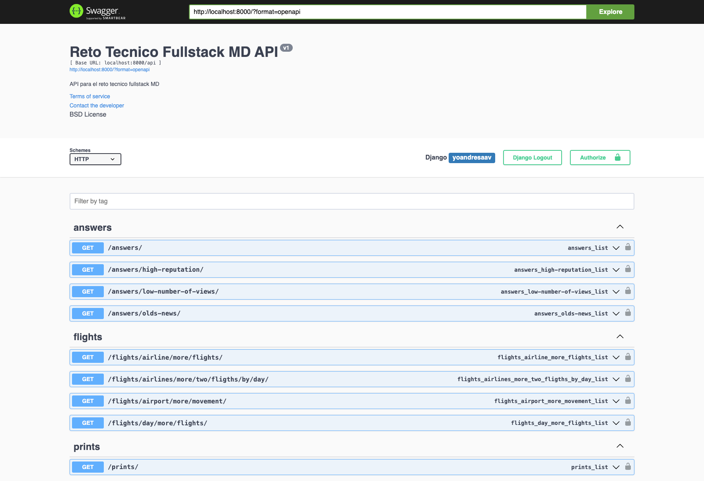
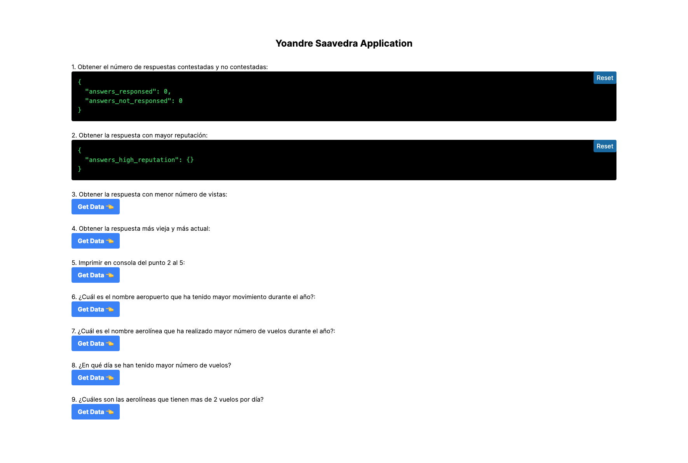

## Description

This project run a Django/REST and Next.js applications in Docker just ready to develop.

## Run all project

Create a new folder and cd in, then:

```bash
git clone https://github.com/yoandresaav/reto-tecnico-md.git .
docker compose up --force-recreate --build -d
```

After few seconds in web browser open frontend in

[open frontend link](http://localhost:3000)

open backend swagger in

[open backend link](http://localhost:8000)

The process of build images takes some seconds in order to download all packages, run migrations, load test data and run tests.

## Only for Build docker image

```bash
docker compose build
```

## Terminate
In the same folder of the project run:

```bash
docker compose down
```

### Some probables errors

In window is possible docker don't detect in backend the start file. Open start.sh file in VSCode and change Select End of Line Sequence from CRLF to LF.

Important Note: Check don't have anothers apps running in ports 3000 and 8000.

In case of others error please open a fix in this ripository.


## Images





